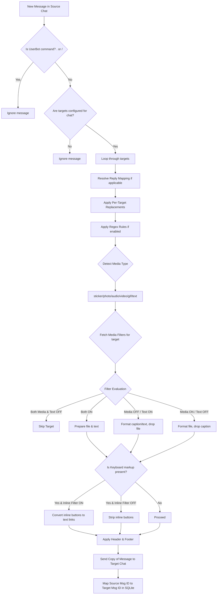

# TeleFlow — Technical & User Documentation

Welcome to the official documentation for **TeleFlow**, a modular, high-performance Telegram Channel Automation Platform. TeleFlow is designed to bridge channels and groups together, providing real-time forwarding, live content synchronization (Edits, Deletes, Reactions), advanced text replacements, regular expression rules, and precise media-type filtering.

---

## 📖 Table of Contents
1. [Platform Architecture & Workflows](#1-platform-architecture--workflows)
2. [Folder & File Directory Map](#2-folder--file-directory-map)
3. [Setup & Installation](#3-setup--installation)
4. [UserBot Commands Reference](#4-userbot-commands-reference)
5. [Interactive Assistant Bot UI Guide](#5-interactive-assistant-bot-ui-guide)
6. [Advanced Feature Deep Dives](#6-advanced-feature-deep-dives)
7. [Database Schema Definition](#7-database-schema-definition)

---

## 1. Platform Architecture & Workflows

TeleFlow operates using a **Dual-Engine Architecture** running asynchronously:
*   **UserBot Engine (Telethon Client)**: Logs in as a standard Telegram user account. It monitors source chats for incoming messages, applies transformation filters/replacements, forwards messages to target chats in Copy Mode (without the "Forwarded from" tag), and maintains real-time synchronization for edits, deletes, and reactions.
*   **Assistant Bot Engine (Telethon Bot Client)**: Runs concurrently using a Telegram Bot Token. It acts as an interactive control panel dashboard for the owner/super-users, offering inline menus to modify configurations dynamically.

### Message Flow Workflow



---

## 2. Folder & File Directory Map

The following map defines the structural responsibility of each file inside the `TeleFlow` workspace:

```text
TeleFlow/
│
├── bot.py                      # Main entrypoint; boots UserBot + Assistant Bot concurrently.
├── login.py                    # Authorization script to generate Telethon StringSession.
├── loader.py                   # Dynamic handler module registry and runtime controller.
├── config.py                   # System-wide configuration parsing (.env loader).
├── requirements.txt            # Python dependencies (Telethon, SQLite, python-dotenv).
│
├── core/                       # Core system logic
│   ├── client.py               # Singleton clients initializer for UserBot and Bot.
│   ├── logger.py               # Central log decorator and stdout configurations.
│   ├── permissions.py          # Authorization filters (is_bot_owner, authorized_only).
│   └── utils.py                # Command and callback responder helpers.
│
├── database/                   # SQLite persistence layer
│   └── database.py             # Table schema initializations and CRUD operations.
│
├── commands/                   # UserBot command modules
│   ├── channel_manager.py      # Core setup commands (.add, .remove, .list).
│   ├── transform.py            # Transformation management (.replace, .header, /regex_add).
│   ├── super_users.py          # Admin delegation controllers.
│   ├── start.py                # Bot assistant /start redirection.
│   └── ping.py                 # Core latency testing.
│
├── modules/                    # UserBot event listeners
│   ├── forwarder.py            # Primary message forwarding, filtering & text manipulation engine.
│   └── sync.py                 # Core engine syncing message edits, deletes, and reactions.
│
└── assistant/                  # Bot assistant interface
    ├── menu.py                 # Main control dashboard button layout.
    ├── callbacks.py            # Dynamic target link menu, per-target replacements routing.
    ├── media_filter_menu.py    # 7-toggle filter toggles handler (ON/OFF buttons).
    └── regex_conversation.py   # State wizards/dialogs for adding rules interactively.
```

---

## 3. Setup & Installation

### 3.1 Prerequisites
- Python 3.10+ Installed.
- A Telegram Application API Credentials (`API_ID` & `API_HASH`) from [my.telegram.org](https://my.telegram.org).
- A Telegram Bot token created via [@BotFather](https://t.me/BotFather).

### 3.2 Environment Setup
Create a `.env` file in the project root:
```env
API_ID=1234567                     # Your API ID
API_HASH=your_api_hash_here         # Your API Hash
BOT_TOKEN=123456:ABC-DEF1234ghI    # Assistant Bot Token
OWNER_ID=1217850333                # Primary owner Telegram ID (integer)
USERBOT_SESSION=                   # Generated automatically or left blank for manual generation
```

### 3.3 Authorization Login
Run the login script in your terminal to authenticate your UserBot:
```bash
python login.py
```
This generates a Telethon `StringSession` and saves it to your `.env` file automatically.

### 3.4 Starting the Application
Start both engines with the following command:
```bash
python bot.py
```

---

## 4. UserBot Commands Reference

UserBot commands are prefixed with `.` or `/` and can be executed by the authorized account directly in any Telegram chat.

### 4.1 Forward Rules Commands
-   **`.add <source> <target>`**:
    -   *Action*: Establishes a real-time copying stream from a source chat to a target chat.
    -   *Parameters*: User IDs, Channel usernames (e.g. `@my_channel`), or private channel hashes.
    -   *Example*: `.add @source_channel -1004321870647`
-   **`.remove <source> <target>`**:
    -   *Action*: Deletes the copying stream mapping.
    -   *Example*: `.remove @source_channel -1004321870647`
-   **`.list`**:
    -   *Action*: Lists all active forwarding link rules.
-   **`.status`**:
    -   *Action*: Shows engine uptime and rule counts.

### 4.2 Text Transformation Commands
-   **`.replace <source> "<find>" "<replace>"`**:
    -   *Action*: Creates a global source replacement mapping for plain strings.
    -   *Example*: `.replace @source_channel "PromoCode" "MyCode"`
-   **`.replace_del <source> "<find>"`**:
    -   *Action*: Deletes a global text replacement.
-   **`.replace_list <source>`**:
    -   *Action*: Lists all plain string replacements for a source chat.
-   **`.header <source> <target> <text>`**:
    -   *Action*: Prepends a formatted header text to forwarded messages.
    -   *Example*: `.header @source_channel -10012345 `**Breaking News:**``
-   **`.footer <source> <target> <text>`**:
    -   *Action*: Appends a footer text to forwarded messages.
-   **`.clearheader / .clearfooter <source> <target>`**:
    -   *Action*: Removes headers or footers.

### 4.3 Regex Transformation Commands
-   **`/regex_add <source> <rule_name> <pattern> -> <replacement>`**:
    -   *Action*: Adds a regular expression string modification rule.
    -   *Example*: `/regex_add @source_channel hide_links (www|https?)\S+ -> [Link Hidden]`
-   **`/regex_del <source> <rule_name>`**:
    -   *Action*: Removes a regex rule.
-   **`/regex_list <source>`**:
    -   *Action*: Lists regex rules and shows if regex processing is enabled.
-   **`/regex_on <source>` / `/regex_off <source>`**:
    -   *Action*: Globally toggles regex execution for messages arriving in the source chat.

---

## 5. Interactive Assistant Bot UI Guide

The Assistant Bot provides a touch-friendly interface via inline keyboards. Send `/start` to the Bot to access the control panel.

### 5.1 Main Control Dashboard
*   **Manage Chats**: View all channels/groups where the UserBot is currently joined. Select a chat to open its detail page.
*   **Join Chat**: Command the UserBot to join a new channel/group via invite link or username.
*   **System Status**: View live stats, uptime, rule states, and userbot health.
*   **Super Users**: Add/remove authorized users who can control the Bot.

### 5.2 Target Link Detail Page
Clicking a source chat and selecting a configured target opens the **Forwarding Link Details** menu:
1.  **Header / Footer Management**: Tap to modify the header or footer text using guided prompt chats.
2.  **Per-Target Replacements**: Manage plain-text replacements applying *only* to this target channel.
3.  **Regex Rules**: View regex settings.
4.  **Media Filters**: Open the custom 7-toggle media filter screen.
5.  **Delete Target Link**: Instantly destroy the target link.

### 5.3 7-Toggle Media Filters Menu
This screen lets you toggle ON (🟢) or OFF (🔴) what content gets sent to this specific target:
*   **Text 🟢/🔴**: Text-only messages.
*   **Sticker 🟢/🔴**: Sticker forwards.
*   **Photo 🟢/🔴**: Photo images.
*   **Audio 🟢/🔴**: Music/voice files.
*   **Video 🟢/🔴**: Standard videos.
*   **GIF 🟢/🔴**: Silent looping animated files.
*   **Inline Buttons 🟢/🔴**: Converts links/buttons inside incoming messages.

---

## 6. Advanced Feature Deep Dives

### 6.1 Inline Buttons to Markdown Conversion
Because Telegram UserBots represent standard human accounts, they cannot natively attach interactive inline keyboards (`reply_markup`) to outgoing messages (Telegram restricts this privilege to actual bots).

To solve this, when **Inline Buttons** filter is set to **ON** (🟢):
1.  TeleFlow scans incoming messages for `ReplyInlineMarkup`.
2.  It parses button rows and checks button types.
3.  If a URL button (`KeyboardButtonUrl`) is found, it converts it to: `[Button Label](URL)`.
4.  Other buttons are converted to labeled text: `[Button Label]`.
5.  All labels are joined (separated by ` | ` for the same row) and appended at the bottom of the forwarded text or media caption.

*If set to **OFF** (🔴), buttons are completely stripped from the forwarded message.*

### 6.2 GIF Detection & Forwarding
GIFs in Telegram are not sent as simple videos; they are technically silent `Document` objects with the `DocumentAttributeAnimated` attribute. TeleFlow accurately checks this attribute:
```python
is_gif = False
if msg.document:
    if any(isinstance(x, DocumentAttributeAnimated) for x in msg.document.attributes):
        is_gif = True
```
This isolates GIFs from standard videos or photos, allowing the **GIF Filter** to operate correctly without throwing AttributeErrors.

### 6.3 Content Filtering Logic Matrix
The forwarder uses the following matrix to decide what goes through to a target chat:

| Media Allowed | Text Allowed | Incoming Message Type | Final Forward Outcome |
| :--- | :--- | :--- | :--- |
| **ON** (1) | **ON** (1) | Media + Caption | Media file sent with the full caption. |
| **ON** (1) | **OFF** (0) | Media + Caption | Media file sent without a caption. |
| **OFF** (0) | **ON** (1) | Media + Caption | Only the caption is sent as a plain text message. |
| **OFF** (0) | **OFF** (0) | Media + Caption | Message is skipped entirely. |
| — | **ON** (1) | Text Only | Text message sent. |
| — | **OFF** (0) | Text Only | Message is skipped entirely. |

### 6.4 Edit, Delete & Reaction Synchronization
-   **Edit Sync**: Whenever a message in a source chat is modified, `MessageEdited` triggers. TeleFlow queries the database mapping (`message_map`), applies replacements, runs regex, appends headers/footers/inline-text, and edits the target message.
-   **Delete Sync**: When a message is deleted, the `MessageDeleted` event triggers. TeleFlow deletes the corresponding target messages and cleans up the SQLite mapping records.
-   **Reaction Sync**: Tracks raw `UpdateMessageReactions` events, extracts the emoji characters, and applies matching reactions to the target message.

---

## 7. Database Schema Definition

TeleFlow uses an SQLite database located at `data/userbot.db` with the following tables:

### 7.1 `forwards` Table
Tracks active forwarding configurations:
```sql
CREATE TABLE forwards (
    id INTEGER PRIMARY KEY AUTOINCREMENT,
    source_id INTEGER NOT NULL,
    target_id INTEGER NOT NULL,
    is_active INTEGER DEFAULT 1,
    UNIQUE(source_id, target_id)
);
```

### 7.2 `media_filters` Table
Tracks per-link media-type settings (1 = ON, 0 = OFF):
```sql
CREATE TABLE media_filters (
    source_id   INTEGER NOT NULL,
    target_id   INTEGER NOT NULL,
    text        INTEGER DEFAULT 1,
    sticker     INTEGER DEFAULT 1,
    photo       INTEGER DEFAULT 1,
    audio       INTEGER DEFAULT 1,
    video       INTEGER DEFAULT 1,
    gif         INTEGER DEFAULT 1,
    inline_btn  INTEGER DEFAULT 1,
    PRIMARY KEY (source_id, target_id)
);
```

### 7.3 `replacements` Table
Stores replacements (source-wide if `target_id` is `NULL`, or specific to a forwarding link if `target_id` is set):
```sql
CREATE TABLE replacements (
    id INTEGER PRIMARY KEY AUTOINCREMENT,
    source_id INTEGER NOT NULL,
    target_id INTEGER,
    find_text TEXT NOT NULL,
    replace_text TEXT NOT NULL,
    UNIQUE(source_id, target_id, find_text)
);
```

### 7.4 `regex_rules` Table
Stores regex patterns per source chat:
```sql
CREATE TABLE regex_rules (
    id INTEGER PRIMARY KEY AUTOINCREMENT,
    source_id INTEGER NOT NULL,
    rule_name TEXT NOT NULL,
    pattern TEXT NOT NULL,
    replacement TEXT NOT NULL,
    created_at INTEGER DEFAULT (CAST(strftime('%s','now') AS INTEGER)),
    UNIQUE(source_id, rule_name)
);
```

### 7.5 `message_map` Table
Maintains IDs mapping for edit/delete synchronization:
```sql
CREATE TABLE message_map (
    source_id INTEGER NOT NULL,
    source_msg_id INTEGER NOT NULL,
    target_id INTEGER NOT NULL,
    target_msg_id INTEGER NOT NULL,
    PRIMARY KEY(source_id, source_msg_id, target_id)
);
```
